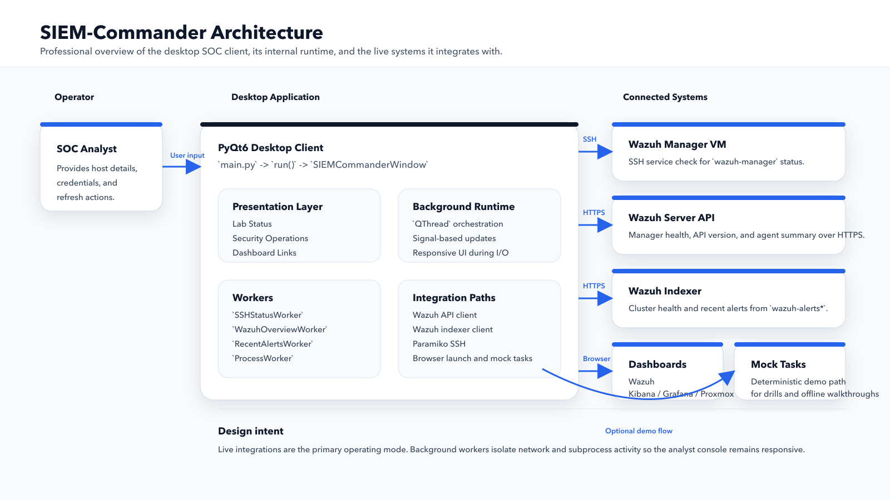
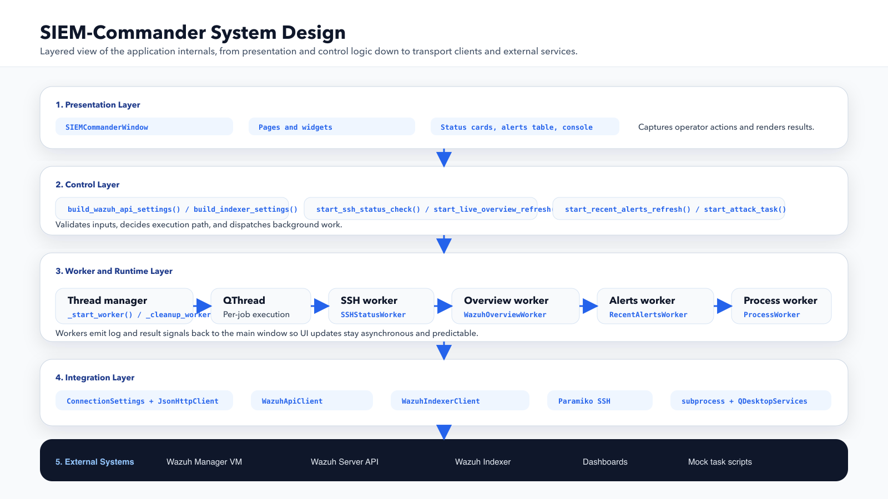
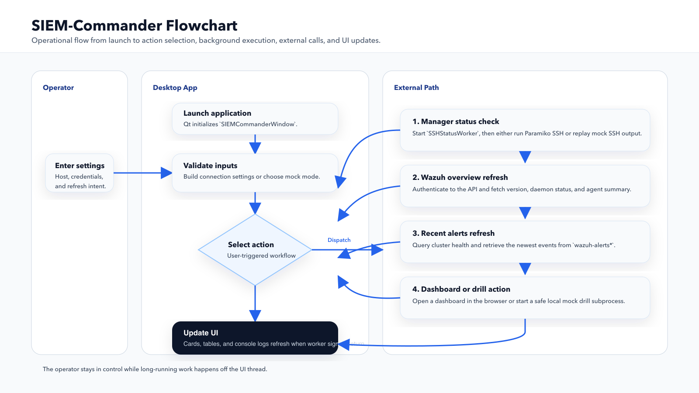

# SIEM-Commander

SIEM-Commander is a PyQt6 desktop SOC analyst console for a Wazuh lab environment. It is designed to be a real client for an existing SIEM stack, not just a UI mockup.

It provides:

- Live Wazuh server API connectivity for manager and agent health
- Live Wazuh indexer queries for recent security alerts
- SSH-based `wazuh-manager` service checks
- Quick-launch links for Wazuh, Kibana, Grafana, and Proxmox
- Threaded task execution so the UI stays responsive
- Optional lab drill simulations for offline demos and detection exercises

## What This Project Is

- A desktop SOC console that can connect to a real Wazuh deployment
- A portfolio project that shows security monitoring integration work
- A practical lab tool for checking manager health, agent status, and recent alerts

## What This Project Is Not

- It is not a full SIEM platform built from scratch
- It does not replace Wazuh, Elastic, or OpenSearch
- The drill buttons do not launch real attacks; they only simulate console output

## How It Works

1. Run the PyQt desktop application.
2. In `Lab Status`, enter the VM IP and SSH credentials if you want to verify `wazuh-manager` over SSH.
3. In `Live Wazuh Data Sources`, enter:
   - Wazuh API URL, username, and password
   - Wazuh indexer URL, username, and password
   - Whether to allow self-signed TLS certificates for lab environments
4. Click `Refresh Wazuh Overview`.
   - The app authenticates to the Wazuh server API
   - It pulls API version, manager daemon status, agent summary, and a small agent snapshot
   - Results are shown in the status cards and console
5. Click `Load Recent Alerts`.
   - The app queries the Wazuh indexer
   - It loads the newest alerts into the table on the `Security Operations` page
   - It also shows indexer cluster health and a quick high-severity count
6. Use `Dashboard Links` to open the relevant web consoles in your browser.
7. If you want a demo without touching a live environment, use the optional lab drill simulations.

## UI Sections

### Lab Status

- Platform and connection mode
- Active jobs counter
- Manager service status
- Indexer health
- Agent summary
- Wazuh API version

### Security Operations

- Recent alerts table from the Wazuh indexer
- Optional lab drill simulations for demo and validation use

### Dashboard Links

- Wazuh
- Kibana
- Grafana
- Proxmox

## Install

```bash
python3 -m venv .venv
source .venv/bin/activate
pip install -r requirements.txt
```

## Run

```bash
python3 main.py
```

## Suggested Lab Setup

This project is best used with a home lab or virtual SOC setup that already has:

- A Wazuh manager
- A Wazuh indexer
- A Wazuh dashboard or Kibana
- Optional Grafana and Proxmox access

## Architecture and Design

### Architecture



### System Design



### Flowchart


